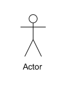
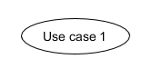
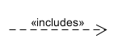

## 简答题
1.用例的概念

用例是系统针对请求进行响应的行为的描述，可以说，用例是基于某种或者多种场景下的系统与用户的交互行为，简单来说，可以理解为用例就是某用户使用系统时能够进行的某操作的描述。
在软件工程中，用例表示一种通过用户的使用场景来获取需求的技术，一般由软件开发者和用户共同编写。

2.用例和场景的关系？什么是主场景或 happy path？

（1）场景：是客户与系统之间的交互行为。场景是用例的实例，一用例是场景的集合

（2） 主场景：是场景中最主要的交互，一般是经常出现的，用户最常用的场景流程。

（3）happy path：在软件或信息建模的环境中，happy path是一种默认没有异常情况而能流畅完成业务的操作路径

3.用例有哪些形式？

（1）Brief（high level）：通常是主场景的总结，在早期分析需求的过程中，breif形式可以帮助开发者和客户快速了解软件系统的主题和应用范围等信息，可以快速创建

（2） Casual（简便格式）：非正式的段落格式；覆盖多个场景的几个段落，与breif近似，在早期需求分析过程中，有助于快速了解主题和范围

（3） Fully：用例中所有的步骤和变化都写得很详细，包括前置条件等应用环境。所有的用户样例都已经定制出初步版本后，优先级更高的用例会被详细编写。

4.对于复杂业务，为什么编制完整用例非常难？

对于复杂业务来说，用例的应用场景十分复杂，需要考虑的因素也有很多。而对于前期的需求分析过程，想要在用力建模额过程中就分析出所有的应用场景是理想的情况，实际建模的过程中，一些被遗漏的场景通常会在后期实现的过程中被发现，这时才能继而编写完整的用例。
同时，对于用例建模的过程，如果一开始就建立出较为复杂度较高的用例，可读性也并不是很强。

5.什么是用例图？

用例图是一种以绘图的方式展现用例场景的表示方法。用例图以用户和用户行为为主，可以体现出用户与系统的交互场景，并使用图形化的方式，形象地展示出系统的边界和使用方法，对于开发者和使用者来说，都可以通过用例图了解系统与用户间可能的交互行为

6.用例图的基本符号与元素？

（1） 参与者（actors）：表示系统中的用户，即与系统交互的对象

（2）用例（use case）：用户与系统的交互行为，可以理解为用户可以使用系统做的事情

（3）包含关系（include）：被指向的用例为发起用例的行为之一

（4）扩展关系（extend）：被指向的用例为发起用例的扩展功能

（5）泛化关系（generalization）：被指向的用例是发起用例的特例之一

（6）关联关系（association）：表示参与者与用例之间的关系

7.用例图的画法与步骤

（1）确定系统边界

先使用方框画出系统边界并标记系统名称

（2）确定参与者

明确参与者是谁：用户？管理员？设备？只要是使用系统产生交互的对象都是参与者
在系统边界外部使用参与者符号，添加参与者信息

（3）确定用例

明确系统中的用例场景都有什么：确定系统功能，确定用例之后，在系统方框内添加用例符号并标识用例信息
明确参与者与用例之间的交互关系：确定参与者与用例之间的关系之后就可以使用关联关系的符号将两者相连
明确用例之间的关系：明确将用例之间的关系，分别为泛化关系、包含关系、扩展关系，分别用这三种关系的符号连接相应的用例

（4）确定外部接口

外部接口可能是一些API的调用，在系统方框外用其他的方框标识调用的外部api，并使用关联关系符号将接口与调用此接口的用例相连

8.用例图给利益相关人与开发者的价值有哪些？

（1）用例图便于帮助未参与需求设计的开发者更好地理解系统功能，是开发者与产品负责人沟通的桥梁

（2）用例图可以形象地展示系统边界以及系统功能，对于项目工作量的呈现也是十分形象化的

（3）用例图可以帮助开发者梳理项目开发流程与技术要点，便于开发者进行研究学习与开发准备

## 建模练习题（用例模型）

- 选择2-3个你熟悉的类似业务的在线服务系统（或移动 APP），如定旅馆（携程、去哪儿等）、定电影票、背单词APP等，分别绘制它们用例图。并满足以下要求：
- 请使用用户的视角，描述用户目标或系统提供的服务别于竞争对手的）用例或子用例
- 尽可能识别外部系统和服务

- 粒度达到子用例级别，并用 include 和 exclude 关联它们
- 请用色彩标注出你认为创新（区别于竞争对手的）用例或子用例
- 尽可能识别外部系统和服务
## 然后，回答下列问题：

1.为什么相似系统的用例图是相似的？

由于用户对于某一特定目标的的广泛需求是固定的，所以为了满足用户最基本的需要、让系统功能的基础建设较为完善，不同的系统开发团队都会针对这部分最广泛的需求进行功能设计，也就是说这个软件的不同点往往不在用例上，而是在交互设计上，所以，对于展示用例场景的用例图来说，相似系统往往是差不多的。

2.如果是定旅馆业务，请对比 Asg_RH用例图，简述如何利用不同时代、不同地区产品的用例图，展现、突出创新业务和技术
使用不同颜色进行标识

3.如何利用用例图定位创新思路（业务创新、或技术创新、或商业模式创新）在系统中的作用
可以使用较为鲜艳的颜色对需要表示的创新点进行标识

4请使用SCRUM方法，选择一个用例图，编制某定旅馆开发的需求（backlog）开发计划表

|ID	|	TITLE	|IMP|EST|ITER	|HOW TO DEMO
|---|-----------|---|---|-------|------------|
|1	|查看列表		|5	|2	|1		|主页查看酒店的简略信息，点击查看酒店详情，包括位置、星级、评价等信息
|2	|排序		|4	|3	|2		|按照好评、价格、距离等排序
|3	|预定酒店		|5	|3	|3		|用户预定酒店后保存预定信息
|4	|个人信息编辑	|5	|2	|2		|包括身份信息，支付信息以及其他信息
|5	|支付房费		|5	|1	|2		|使用支付接口
|6	|搜索酒店		|5	|2	|1		|通过姓名、评价、位置等关键词完成搜索
|7	|查看地图		|3	|2	|3		|在地图上查看酒店位置
|8	|学习接口技术	|3	|3	|1		|学习系统功能api使用方法
|9	|订单反馈		|3	|3	|3		|用户评价订单，评价显示

5.根据任务4，参考 使用用例点估算软件成本，给出项目用例点的估算

用例 		|事务	|计算|	原因|	UC权重|
|---|---------------|----|---|-------|------------|
查看列表		|3		|2	|	|	简单
排序			|3		|3	|	|	简单
预订酒店		|4		|4	|	|	简单
个人信息编辑	|3		|3	|	|	简单
支付房费		|2		|1	|	|	简单
搜索酒店		|4		|4	|	|	简单
查看地图		|3		|1	|框架|	简单
学习接口技术	|4		|4	|	|	简单
订单反馈		|6		|6	|	|	平均