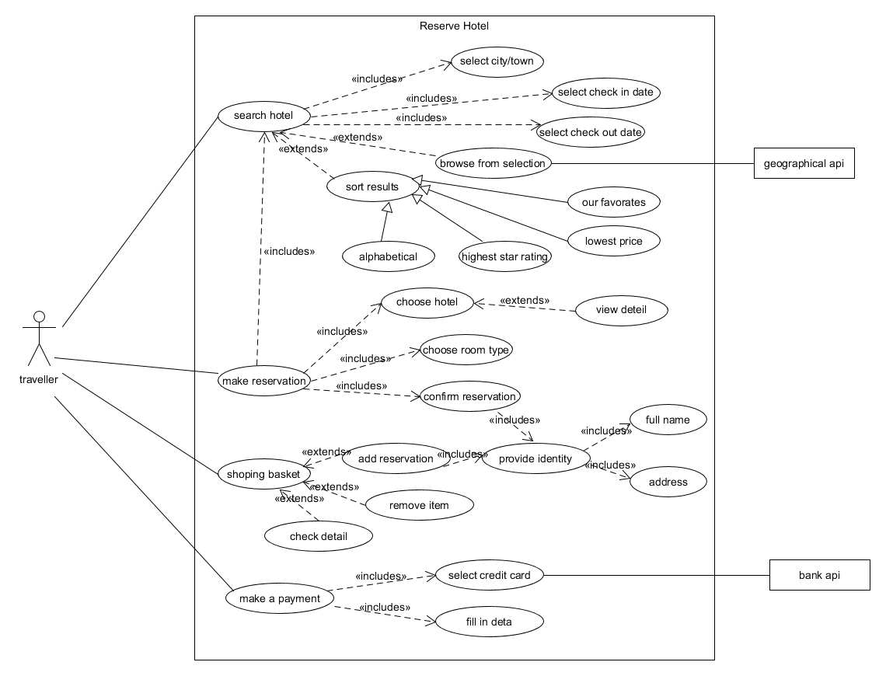
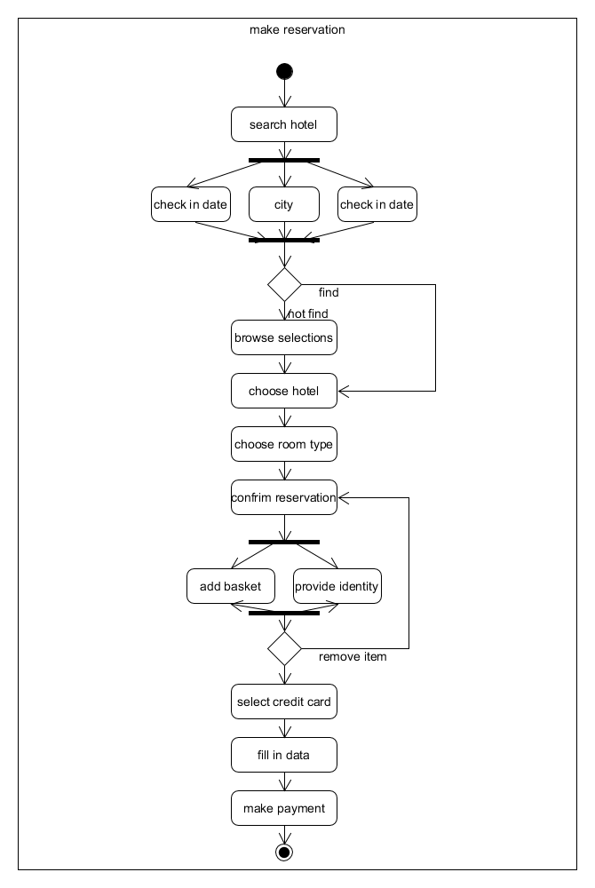
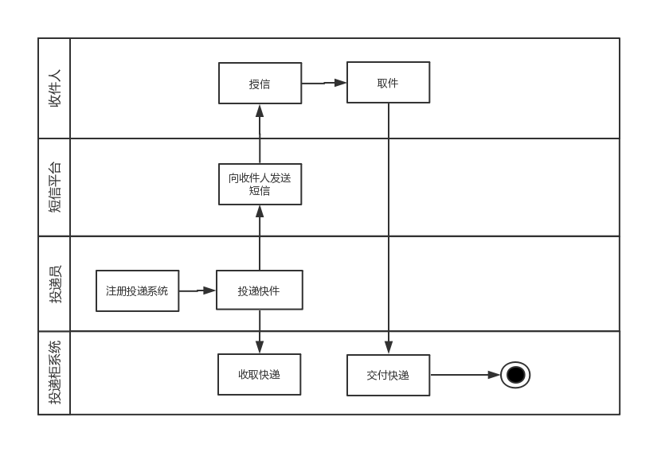
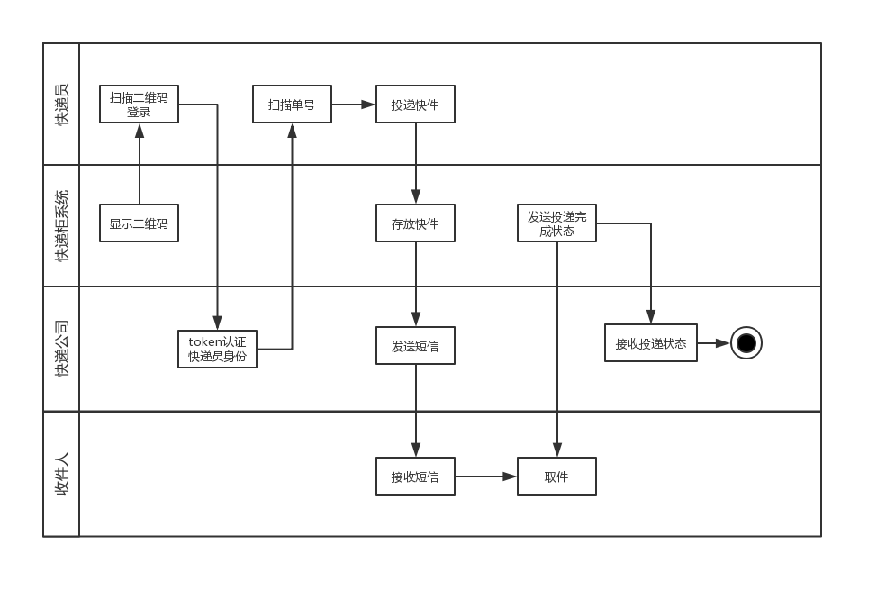
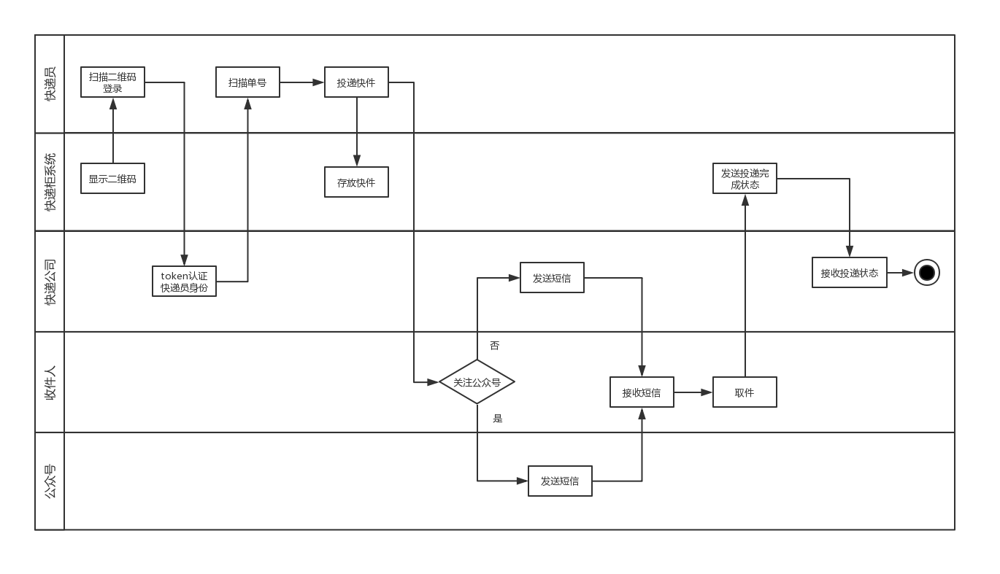
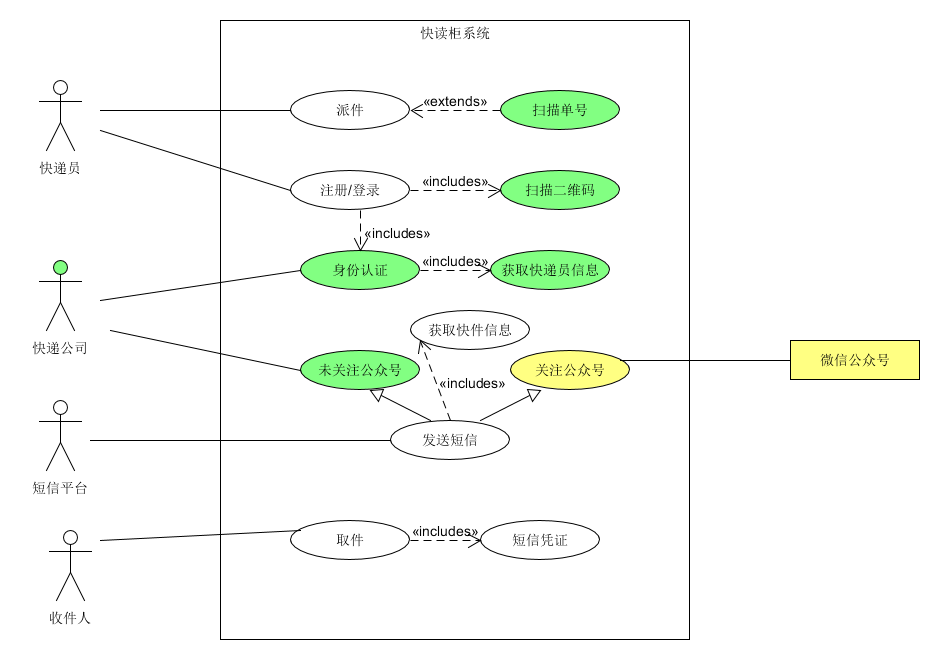

# 作业7

make_reservation

* * *

设计Asg-RH旅馆预定系统用例图
设计预定酒店活动图
设计快递柜系统业务场景泳道图
设计快递柜系统用例图

## Asg-RH

* * *

### Asg用例图

用户交互主要包括搜索旅馆、预定旅馆、购物车操作以及支付，对于这四种交互分别进行用例的完善和关联关系的设计：

1.  搜索旅馆：搜索时需要输入城市、入住日期、离店日期三种必要信息，所以将这三种情况使用include关系与搜索用例关联，同时搜索结果支持排序，以及如果没有搜索结果则查看推荐，于是这两种用例使用extend关系关联：其中，排序功能支持不同的四种元素筛选，所以使用泛化关系丰富排序用例
2.  预定旅馆：预定时必须的流程有搜索、选择旅店、选择房型以及确定预定，其中，选择旅店时需要支持查看详情，确认预定时需要完善全名和地址两种客户信息
3.  购物车操作：购物车支持添加、移出、检查三种操作，其中，用户添加购物车时，首先需要完善个人信息
4.  支付：支付过程中，用户必须进行的操作有选择支付账户，填写必要信息，其中，选择支付账户可以调用外部接口

### Make reservation 活动图

## 快递系统

* * *

### 泳道图

#### 业务1

整体流程：快递员登录-&gt;存放快递-&gt;短信平台发送短信-&gt;收件人凭短信信息取件

#### 业务2

整体流程：快递员扫描二维码登录-&gt;公司认证身份-&gt;快递员扫描单号-&gt;存放快递-&gt;快递公司发送短信-&gt;收件人凭短信信息取件

#### 业务3

整体流程：快递员扫描二维码登录-&gt;公司认证身份-&gt;快递员扫描单号-&gt;存放快递-&gt;判断用户是否关注公众号-&gt;(快递公司/公众号)发送短信-&gt;收件人凭短信信息取件

#### 用例图

