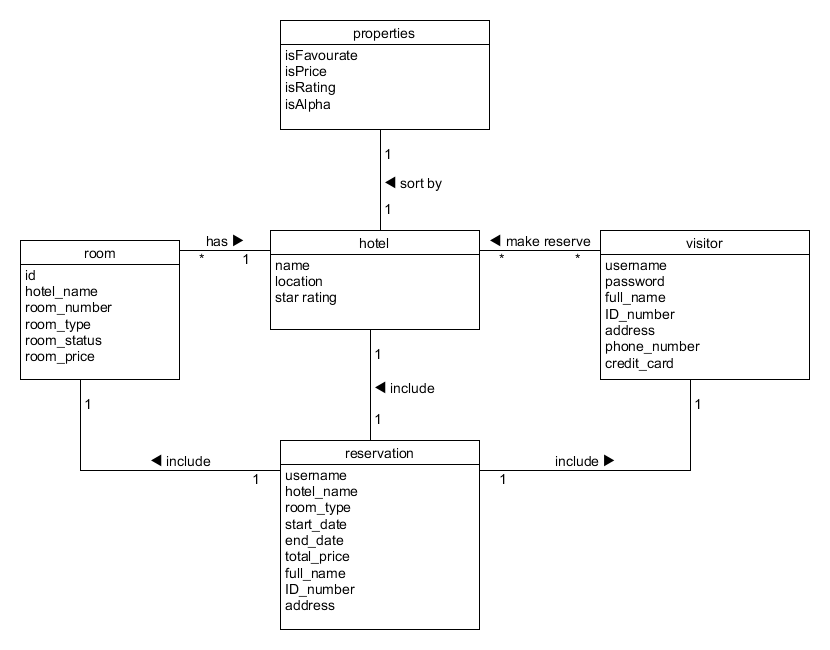
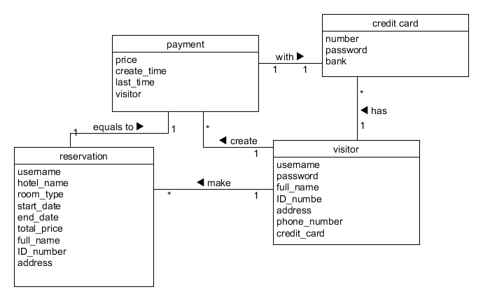
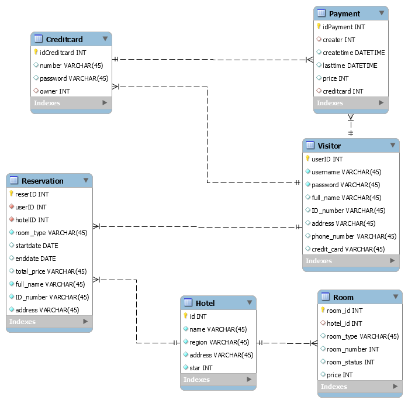

# UMLet建模
---
## 1. 领域建模
### 1.1 Make Reservation

### 1.2 Payment
---

### 1.3 表结构
---
使用mysql进行了数据建模，数据建模的过程发现，其实很多属性都是由其他表中的信息计算得到的


```SQL
-- MySQL Script generated by MySQL Workbench
-- Wed May  1 18:00:34 2019
-- Model: New Model    Version: 1.0
-- MySQL Workbench Forward Engineering

SET @OLD_UNIQUE_CHECKS=@@UNIQUE_CHECKS, UNIQUE_CHECKS=0;
SET @OLD_FOREIGN_KEY_CHECKS=@@FOREIGN_KEY_CHECKS, FOREIGN_KEY_CHECKS=0;
SET @OLD_SQL_MODE=@@SQL_MODE, SQL_MODE='ONLY_FULL_GROUP_BY,STRICT_TRANS_TABLES,NO_ZERO_IN_DATE,NO_ZERO_DATE,ERROR_FOR_DIVISION_BY_ZERO,NO_ENGINE_SUBSTITUTION';

-- -----------------------------------------------------
-- Schema mydb
-- -----------------------------------------------------

-- -----------------------------------------------------
-- Schema mydb
-- -----------------------------------------------------
CREATE SCHEMA IF NOT EXISTS `mydb` DEFAULT CHARACTER SET utf8 ;
USE `mydb` ;

-- -----------------------------------------------------
-- Table `mydb`.`Hotel`
-- -----------------------------------------------------
CREATE TABLE IF NOT EXISTS `mydb`.`Hotel` (
  `id` INT NOT NULL AUTO_INCREMENT,
  `name` VARCHAR(45) NOT NULL,
  `region` VARCHAR(45) NOT NULL,
  `address` VARCHAR(45) NOT NULL,
  `star` INT NOT NULL,
  PRIMARY KEY (`id`))
ENGINE = InnoDB;


-- -----------------------------------------------------
-- Table `mydb`.`Room`
-- -----------------------------------------------------
CREATE TABLE IF NOT EXISTS `mydb`.`Room` (
  `room_id` INT UNSIGNED NOT NULL DEFAULT 1,
  `hotel_id` INT NULL,
  `room_type` VARCHAR(45) NULL,
  `room_number` INT NULL,
  `room_status` INT NULL,
  `price` INT NULL,
  PRIMARY KEY (`room_id`),
  INDEX `rtoh_idx` (`hotel_id` ASC) VISIBLE,
  CONSTRAINT `rtoh`
    FOREIGN KEY (`hotel_id`)
    REFERENCES `mydb`.`Hotel` (`id`)
    ON DELETE CASCADE
    ON UPDATE CASCADE)
ENGINE = InnoDB;


-- -----------------------------------------------------
-- Table `mydb`.`Visitor`
-- -----------------------------------------------------
CREATE TABLE IF NOT EXISTS `mydb`.`Visitor` (
  `userID` INT NOT NULL AUTO_INCREMENT,
  `username` VARCHAR(45) NOT NULL,
  `password` VARCHAR(45) NOT NULL,
  `full_name` VARCHAR(45) NULL,
  `ID_number` VARCHAR(45) NULL,
  `address` VARCHAR(45) NULL,
  `phone_number` VARCHAR(45) NULL,
  `credit_card` VARCHAR(45) NULL,
  PRIMARY KEY (`userID`),
  UNIQUE INDEX `username_UNIQUE` (`username` ASC) VISIBLE)
ENGINE = InnoDB;


-- -----------------------------------------------------
-- Table `mydb`.`Reservation`
-- -----------------------------------------------------
CREATE TABLE IF NOT EXISTS `mydb`.`Reservation` (
  `reserID` INT NOT NULL AUTO_INCREMENT,
  `userID` INT NOT NULL,
  `hotelID` INT NOT NULL,
  `room_type` VARCHAR(45) NOT NULL,
  `startdate` DATE NULL,
  `enddate` DATE NULL,
  `total_price` VARCHAR(45) NULL,
  `full_name` VARCHAR(45) NOT NULL,
  `ID_number` VARCHAR(45) NOT NULL,
  `address` VARCHAR(45) NOT NULL,
  PRIMARY KEY (`reserID`),
  INDEX `retov_idx` (`userID` ASC) VISIBLE,
  INDEX `retoh_idx` (`hotelID` ASC) VISIBLE,
  CONSTRAINT `retov`
    FOREIGN KEY (`userID`)
    REFERENCES `mydb`.`Visitor` (`userID`)
    ON DELETE NO ACTION
    ON UPDATE NO ACTION,
  CONSTRAINT `retoh`
    FOREIGN KEY (`hotelID`)
    REFERENCES `mydb`.`Hotel` (`id`)
    ON DELETE NO ACTION
    ON UPDATE NO ACTION)
ENGINE = InnoDB;


-- -----------------------------------------------------
-- Table `mydb`.`Creditcard`
-- -----------------------------------------------------
CREATE TABLE IF NOT EXISTS `mydb`.`Creditcard` (
  `idCreditcard` INT NOT NULL AUTO_INCREMENT,
  `number` VARCHAR(45) NULL,
  `password` VARCHAR(45) NULL,
  `owner` INT NULL,
  PRIMARY KEY (`idCreditcard`),
  INDEX `ctov_idx` (`owner` ASC) VISIBLE,
  CONSTRAINT `ctov`
    FOREIGN KEY (`owner`)
    REFERENCES `mydb`.`Visitor` (`userID`)
    ON DELETE NO ACTION
    ON UPDATE NO ACTION)
ENGINE = InnoDB;


-- -----------------------------------------------------
-- Table `mydb`.`Payment`
-- -----------------------------------------------------
CREATE TABLE IF NOT EXISTS `mydb`.`Payment` (
  `idPayment` INT NOT NULL AUTO_INCREMENT,
  `creater` INT NULL,
  `createtime` DATETIME NULL,
  `lasttime` DATETIME NULL,
  `price` INT NULL,
  `creditcard` INT NULL,
  PRIMARY KEY (`idPayment`),
  INDEX `ptov_idx` (`creditcard` ASC) VISIBLE,
  INDEX `ptov_idx1` (`creater` ASC) VISIBLE,
  CONSTRAINT `ptoc`
    FOREIGN KEY (`creditcard`)
    REFERENCES `mydb`.`Creditcard` (`idCreditcard`)
    ON DELETE NO ACTION
    ON UPDATE NO ACTION,
  CONSTRAINT `ptov`
    FOREIGN KEY (`creater`)
    REFERENCES `mydb`.`Visitor` (`userID`)
    ON DELETE NO ACTION
    ON UPDATE NO ACTION)
ENGINE = InnoDB;


SET SQL_MODE=@OLD_SQL_MODE;
SET FOREIGN_KEY_CHECKS=@OLD_FOREIGN_KEY_CHECKS;
SET UNIQUE_CHECKS=@OLD_UNIQUE_CHECKS;
```

## 2. Reservation生命周期建模
---
整个状态过程如下：

1. 首先进行旅馆的搜索：分别要进行城市、起始时间、结束时间的输入，当没有找到结果时，需要在地图上进行搜索，这都是在第一个搜索旅馆状态中的子状态
2. 搜索结束后，要对搜索结果进行显示，也就是showhotel状态，此时如果进行sort操作，还是位于当前show hotel状态，不过是排序后的结果
3. 选择目标旅馆之后可以查看旅馆详情，此时，如果认为不满意，可以返回到show hotel状态
4. 如果认为满意，可以进行预订，选择房间型号、并提供正确的姓名和地址（默认显示用户自己的全名和地址），如果信息未填写完即取消，可以返回查看详情页面
5. 确定预订之后进行支付，支付时需要提供有效的银行卡号以及支付密码
6. 如果支付成功，则等待订单完成，如果支付失败即取消，则结束
7. 如果订单成功完成，或者临时被取消，那么都进入结束状态

